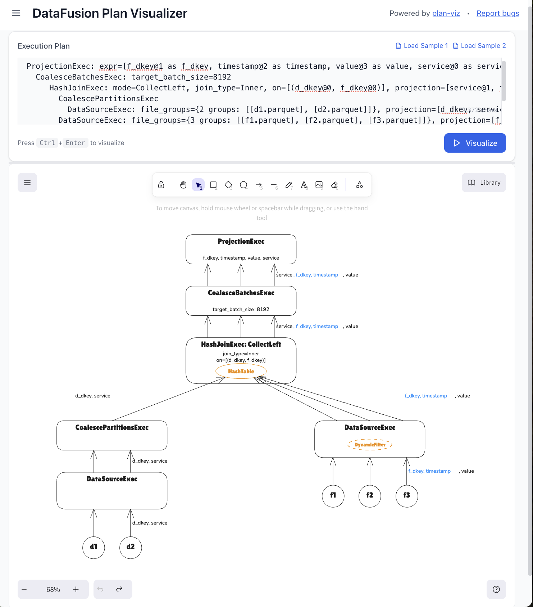

# Plan Visualizer

A graphical web application for visualizing Apache DataFusion physical execution plans as interactive Excalidraw diagrams. Convert execution plans into clear visualizations with color coding that highlights key properties like parallelism, sort order preservation, pushdown optimizations, and operator selection. Identify bottlenecks and performance improvement opportunities throughout the plan.

## Features

- **Color-Coded Visualization**: See key execution properties highlighted throughout the plan
- **Performance Insights**: Identify bottlenecks such as lost parallelism or sort order, missing pushdown optimizations, and suboptimal operator selection
- **Interactive Editing**: Edit plans directly in Excalidraw and save back to JSON
- **Export & Share**: Export to PNG or SVG for documentation and presentations
- **Collaboration**: Open the Excalidraw JSON in excalidraw.com for real-time collaborative editing
- **Offline Support**: Works without internet connection using service workers and local storage

## Try It Now

**[🚀 Use Online App](https://nga-tran.github.io/plan-visualizer/)**

Simply paste your DataFusion physical execution plan and watch it transform into an interactive Excalidraw diagram.

## Powered By

This project is built using **[plan-viz](https://www.npmjs.com/package/plan-viz)** ([GitHub](https://github.com/NGA-TRAN/plan_viz)), an npm package that converts Apache DataFusion physical execution plans into Excalidraw-JSON. The library uses color coding to highlight key properties and propagate them throughout the plan.

Explore many example execution plans in the plan-viz [tests folder](https://github.com/NGA-TRAN/plan_viz/tree/master/tests) covering different DataFusion operators and patterns.

New to query plans? See plan-viz's [Output Analysis](https://github.com/NGA-TRAN/plan_viz#output-analysis) section for examples on how to read them and determine if the plan is optimal.

## Roadmap

- **Interactive Query Builder**: Create tables, insert data, or link to existing files
- **DataFusion Integration**: Run queries and generate EXPLAIN plans directly within the application
- **Enhanced Visualization**: Additional diagram styles and customization options

## Built With

This project was developed using **[SpecKit](https://github.com/DINHDUY/spec-driven-ai-dev/blob/master/docs/AI-assisted%20Development%20with%20SpecKit.md)**, a specification-driven development framework that enables AI-assisted development through structured specifications and automated planning.

## Contributing

We welcome contributions! Please see our [Contributing Guide](CONTRIBUTING.md) for details on how to get started, including:

- How to fork the repository
- Development setup and workflow
- Testing your changes locally
- Submitting pull requests

## License

Licensed under the [MIT License](LICENSE).